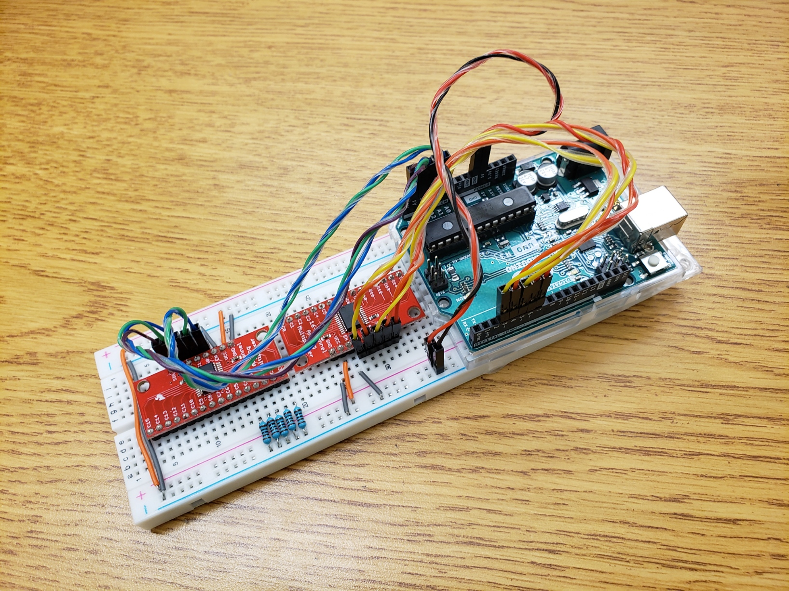
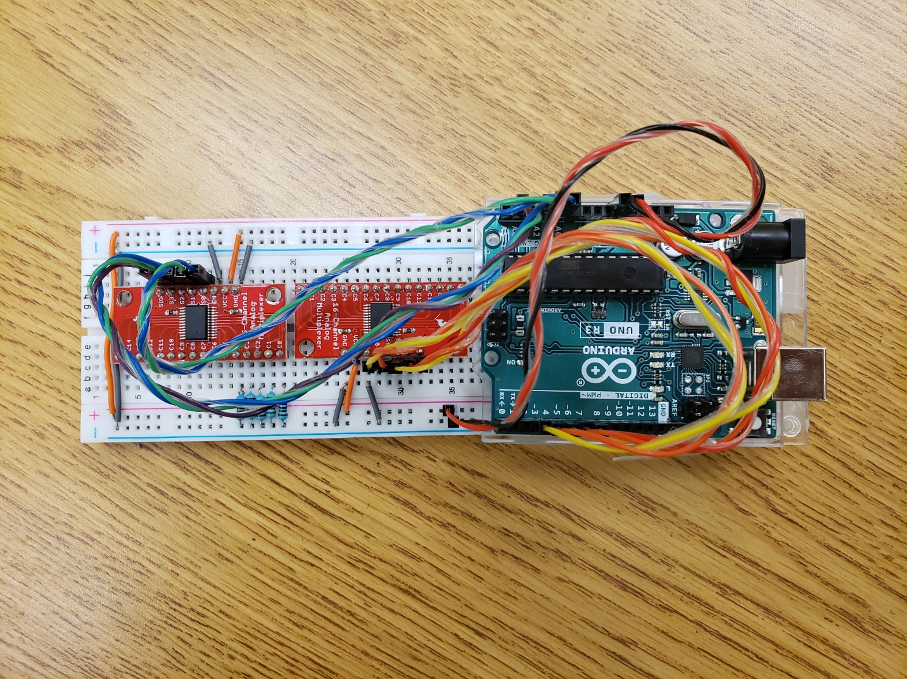
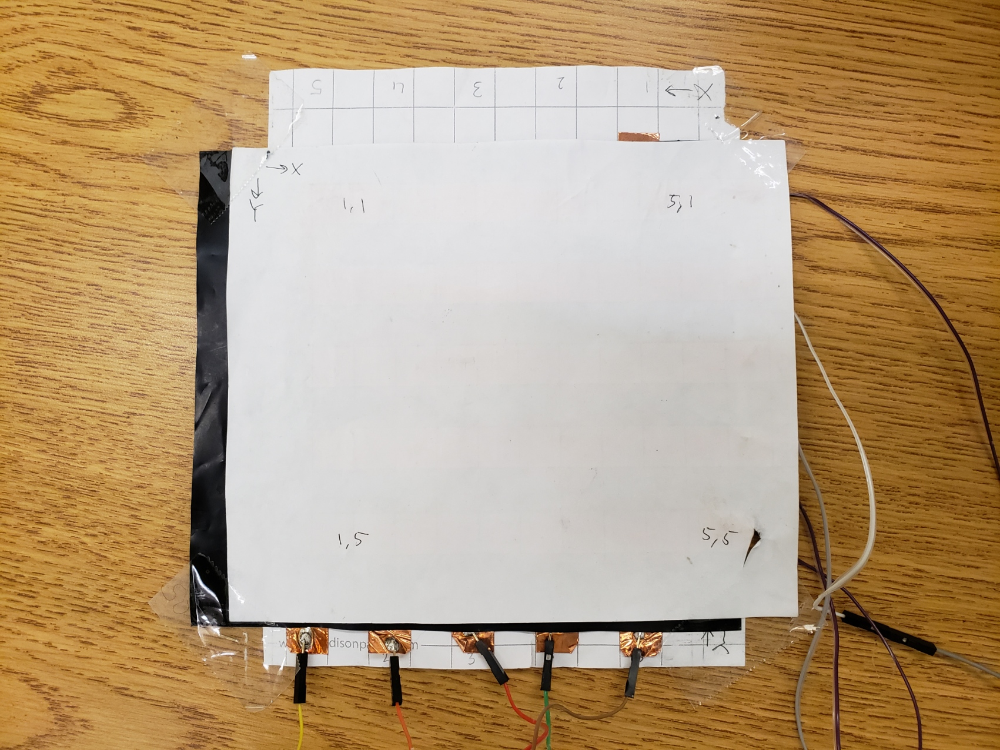
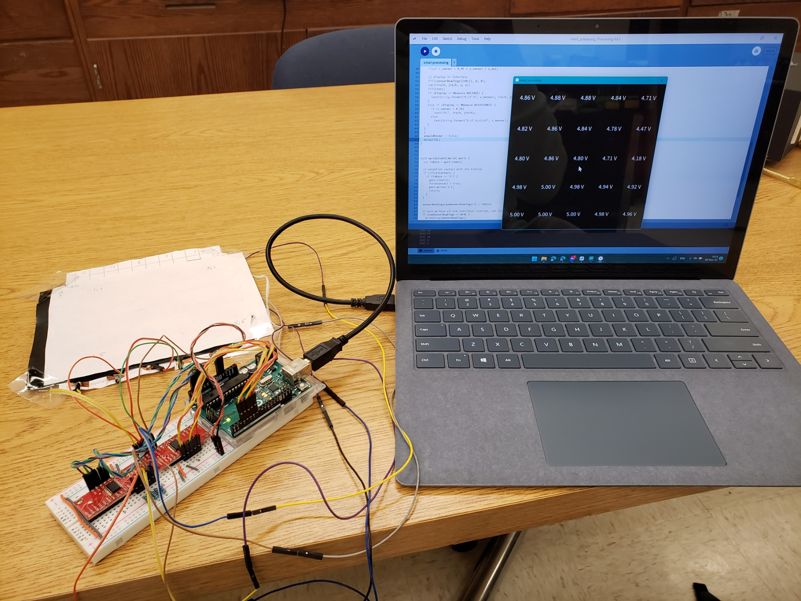
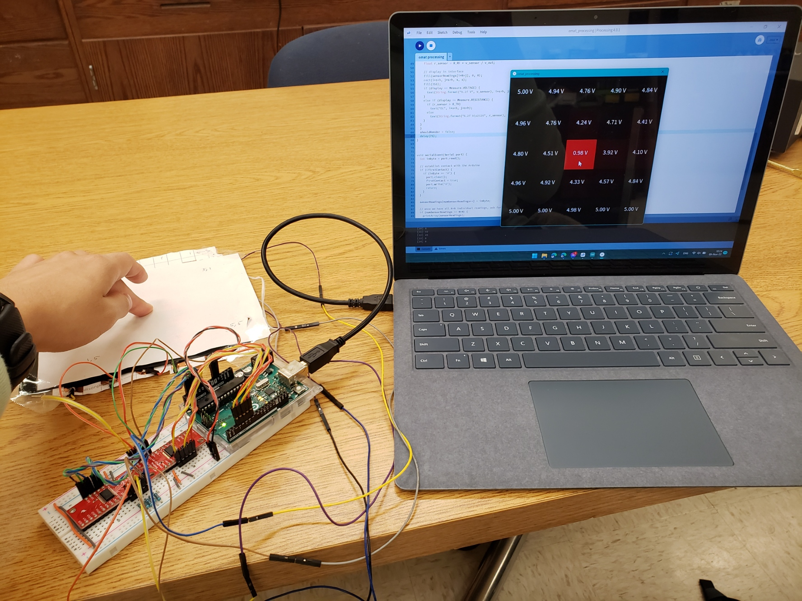
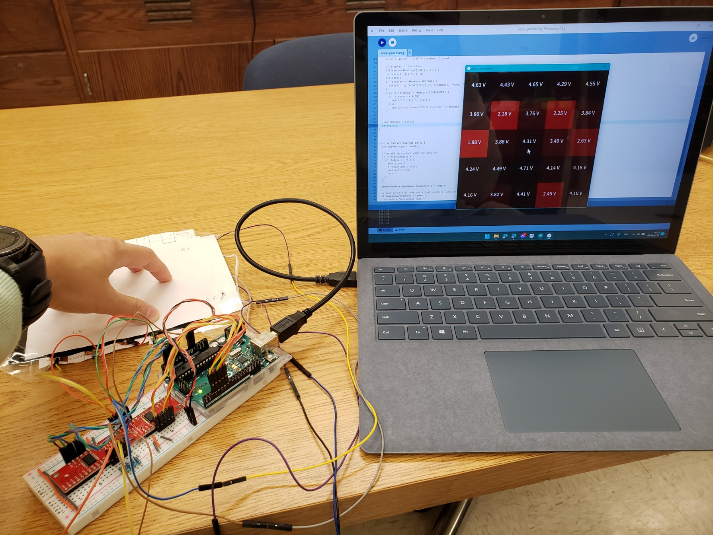

# Omat-Sensor

> ## Table of Conents
> 1. [Introduction](#introduction)
> 1. [Demo](#demo)
> 1. [Details](#details)
> 1. [How to Run](#how-to-run)
> 1. [References](#references)

## Introduction

The O-mat sensor is designed to support flexible and scalable pressure sensors. Using our circuit and code, you can plug in a sensing grid and get a visual representation and log of recorded voltages and resistances.

    
    
    

 

## Demo

    
    
    

 

## Details
The voltage displayed on each grid point is the voltage across each intersection point between the rows and columns. According to our testing, the margin of error from a multimeter reading is &#xB1;0.5V, so keep that in mind if you are using the O-mat sensor for measurement-sensitive applications. Also note that resistance is calculated directly from the voltage reading with respect to a reference resistor, which in our case is 1000&#8486;. You can adjust the `R_RF` variable in Processing as necessary.

Logs are stored at `Omat-Sensor/omat_processing/logs/`. Voltage logs are stored as `voltage-log_XXX.csv` and resistance logs are stored as `resistance-log_XXX.csv`, where `xxx` is the starting timestamp of the log in `YEAR-MONTH-DAY_HOUR-MINUTE-SECOND` format.

## How to Run

### Building the Circuit

**TODO: include circuit diagram**

### Configuring the Code

Once you have the circuit and sensing grid ready, clone or download this repository to your computer (Code > Download ZIP). Extract the ZIP file, and open `Omat-Sensor/omat_arduino/omat_arduino.ino` with the [Arduino IDE](https://www.arduino.cc/en/software). Connect the Arduino to your computer, and select the correct port (Tools > Port), which should have next to it `COM# (Arduino Uno)`. Remember the `COM#`. Once that is done, upload the code to the Arduino board.

Now open `Omat-Sensor/omat_processing/omat_processing.pde` with [Processing](https://processing.org/download) and run the code. If the grid window appears shows up and starts updating, it works, and you can see the real-time visualization and check the logs! However, if it comes up blank or an error pops up, you should check the terminal output at the bottom of the Processing code window. It prints out a list of serial ports in the format `[#] "COM#"`. Change the `SERIAL_PORT` variable at the top to the `#` that matches your `COM#`. Re-run the code, and it should work.

`Warning: Clicking the stop button on Processing causes the serial connection to unexpectedly terminate. Unplug and replug the USB cable to make sure the readings are aligned to the grid.`

## References

* [Original O-mat design](https://www.instructables.com/O-mat/)

<!---
The Arduino sends serial data into a port in the computer, which triggers Processing's serialEvent(), from which we can display the locations and magnitudes of pressure. 
--->
